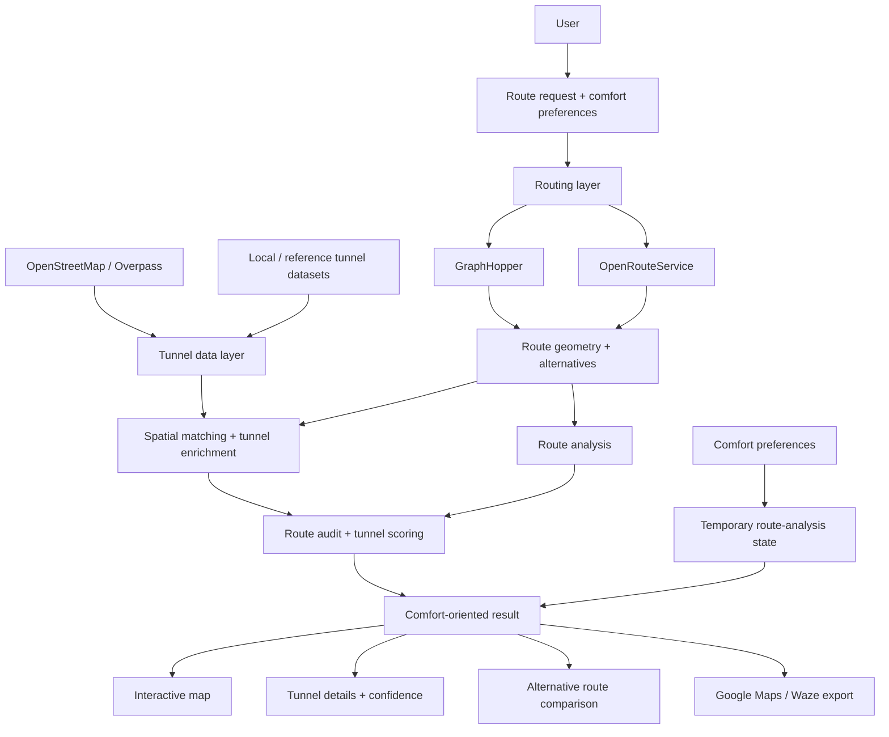

# Architecture Overview

This document summarizes the current Your Way architecture from a product and solution-design perspective.

## Visual architecture

## 1. User flow

A user defines a route and comfort preferences. The application then combines routing information with tunnel-related geographic data to produce a route analysis focused on tunnel exposure and comfort.

## 2. Front-end and application layer

The application is implemented with TypeScript and React, using TanStack Start and TanStack Router.

Main user-facing routes include:

- home and route preparation
- route analysis
- route preparation and comfort preferences
- internal status / development views

The front end is responsible for presenting route choices, confidence information, tunnel details and user preferences.

## 3. Routing layer

Routing logic is centralized in the application logic under `src/lib`.

The project currently integrates third-party routing services including GraphHopper and OpenRouteService.

The application does not treat the routing provider response as the final product output. Route geometry is subsequently analyzed against tunnel data before the user-facing comfort result is produced.

## 4. Tunnel-data layer

Tunnel information comes from several sources and processing steps.

The repository contains logic and documentation for:

- OpenStreetMap tunnel information
- Overpass-based lookups and auditing
- locally stored tunnel data
- enrichment of tunnel information
- reference-data imports
- a France-wide tunnel snapshot
- spatial indexing and corridor matching

The objective is to improve confidence in tunnel detection by avoiding reliance on a single source whenever possible.

## 5. Analysis and scoring

The solution contains dedicated logic for:

- route auditing
- tunnel detection and matching
- tunnel enrichment
- local tunnel repository queries
- spatial indexing
- route/tunnel confidence checks
- user preference handling
- network-budget management

Several of these components also have automated tests in the repository.

## 6. Portfolio snapshot data scope

This portfolio copy does not include accounts, saved route history or personal tunnel notes. Route inputs stay in memory for the request and are sent to configured routing providers to calculate alternatives. Comfort preferences are stored in the user's browser. The original project repository remains unchanged.

## 7. Reliability principles

Reliability is a core part of the product design.

The application includes logic for:

- error capture
- route auditing
- Overpass auditing
- network-budget management
- confidence-oriented messaging
- tested tunnel-matching components

The product principle is that uncertainty should be visible to the user rather than hidden behind an overconfident recommendation.

## 8. External dependencies

The product currently depends on several external services and datasets:

- GraphHopper
- OpenRouteService
- OpenStreetMap
- Overpass API
- Browser-local comfort preferences

This means resilience, rate limits, data quality and third-party availability are important architectural considerations.

## 9. AI-assisted delivery model

Your Way was built using an AI-assisted development workflow.

The project owner is not positioned as a traditional software engineer. The value of the project is in demonstrating the ability to:

- frame a user problem
- translate it into functional requirements
- design a solution architecture
- combine APIs and data sources
- prototype iteratively
- test and debug generated implementations
- document the resulting system
- reason about uncertainty, reliability and user trust

## 10. Current architectural limitations

The current architecture is suitable for an actively developed prototype, but further work would be required for a production-grade service at scale.

Areas to strengthen include:

- formal service-level monitoring
- stronger observability
- explicit third-party fallback strategies
- broader automated test coverage
- secrets-management hardening
- deployment documentation
- measurable data-quality monitoring
- formal performance and load testing
